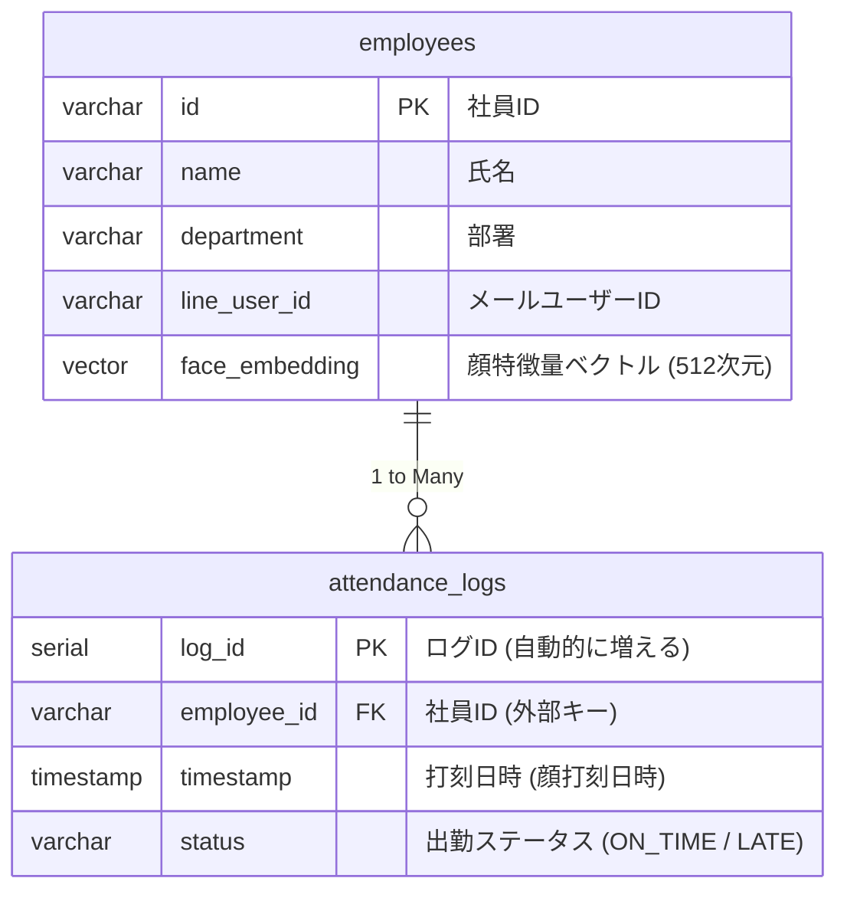

### 👥 1. `employees` テーブル 
| 論理名 | 物理名 | 型 | 制約 | 備考 |
| :--- | :--- | :--- | :--- | :--- |
| 社員ID | `id` | VARCHAR(20) | PRIMARY KEY | 例: `NV001`, `NV002` |
| 氏名 | `name` | VARCHAR(100) | NOT NULL | 会社員の名前 |
| 部署 | `department` | VARCHAR(50) | - | 所属している部署 |
| メール| `mail_user_id` | VARCHAR(50) | UNIQUE | メールで当人にお知らせ |
| 顔特徴量 | `face_embedding` | vector(512) | NOT NULL | InsightFaceから抽出する特徴量 |

### ⏰ 2. `attendance_logs` テーブル 
| 論理名 | 物理名 | 型 | 制約  | 備考  |
| :--- | :--- | :--- | :--- | :--- |
| ログID | `log_id` | SERIAL | PRIMARY KEY | IDが自動的に増える |
| 社員ID | `employee_id` | VARCHAR(20) | FOREIGN KEY | `employees(id)`というテーブルに繋がる |
| 打刻日時 | `timestamp` | TIMESTAMP | NOT NULL, DEFAULT NOW() | システム認識時刻 |
| ステータス | `status` | VARCHAR(20) | NOT NULL | `ON_TIME`, `LATE`, `EARLY` |

---
